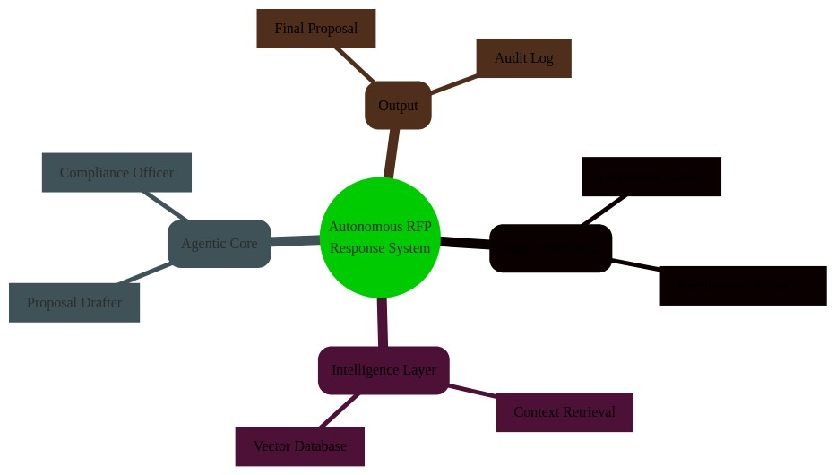
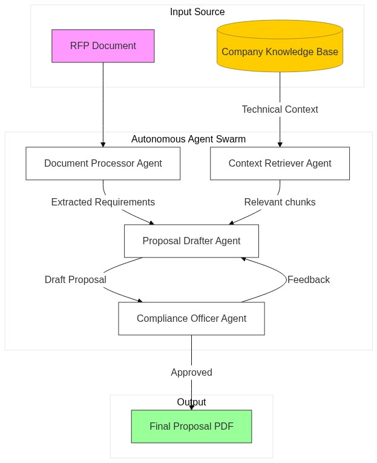
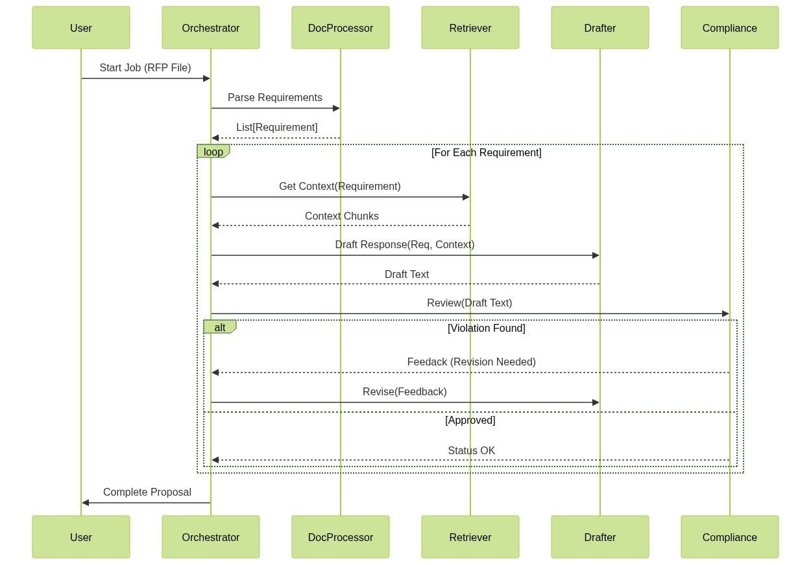

# Autonomous RFP Response System 🤖📝

> **A Multi-Agent System for Automating Complex Business Proposals**



## 📖 Overview

The **Autonomous RFP Response System** is a proof-of-concept (PoC) designed to simulate the workflow of a professional bid team. Instead of manually parsing hundreds of pages of requirements and searching through scattered company documents, this system employs a team of specialized AI agents to:

1.  **Ingest & Analyze** complex RFP documents.
2.  **Retrieve** relevant technical context from a knowledge base.
3.  **Draft** compliant, high-quality responses.
4.  **Review & Refine** content against business rules.

This project demonstrates how we can move beyond simple "chatbots" to **agentic workflows** that solve real-world business problems.

---

## 🏗️ Architecture

The system is built on a modular architecture where each agent has a specific responsibility.



### Key Components

*   **DocumentProcessor**: The "Reading Agent" that extracts requirements from raw text/PDFs.
*   **ContextRetriever**: The "Researcher" that efficiently finds past case studies and technical specs.
*   **ProposalDrafter**: The "Writer" that synthesizes requirements and context into prose.
*   **ComplianceOfficer**: The "Manager" that reviews drafts for forbidden terms and missing info.
*   **Orchestrator**: The central workflow engine that manages the state.

---

## 🚀 Getting Started

### Prerequisites

*   Python 3.10+
*   OpenAI API Key (or compatible LLM endpoint)

### Installation

1.  **Clone the repository**
    ```bash
    git clone https://github.com/Start-With-AI/autonomous-rfp-agent.git
    cd autonomous-rfp-agent
    ```

2.  **Install dependencies**
    ```bash
    pip install -r requirements.txt
    ```

3.  **Configure Environment**
    Create a `.env` file:
    ```bash
    OPENAI_API_KEY=sk-your-key-here
    ```

### Usage

Run the main orchestrator to generate a sample proposal:

```bash
python main.py
```

You will see the agents coordinating in the console output:

```text
[Orchestrator] Starting RFP Process...
[DocumentProcessor] Extracted 5 key requirements.
[ContextRetriever] Found 3 relevant case studies.
[ProposalDrafter] Drafting Section 1.2...
[ComplianceOfficer] Review passed. 
```

---

## 🧪 How It Works (Internals)

### 1. The Workflow
The system uses a sequential state machine. Data flows from the document loader -> vector store query -> LLM generation -> heuristic validation.



### 2. The Knowledge Base
We simulate a Retrieval Augmented Generation (RAG) pipeline using a mock vector store that holds "Company Technical Standards" and "Past Performance" data.

---

## ⚠️ Disclaimer

The views and opinions expressed here are solely my own and do not represent the views, positions, or opinions of my employer or any organization I am affiliated with. The content is based on my personal experience and experimentation and may be incomplete or incorrect. Any errors or misinterpretations are unintentional, and I apologize in advance if any statements are misunderstood or misrepresented.

---

*Built with ❤️ by Aniket as a Sunday Experiment.*
