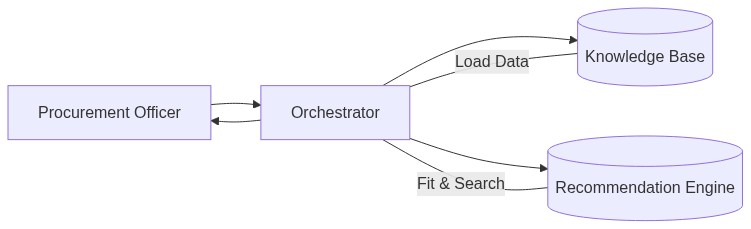
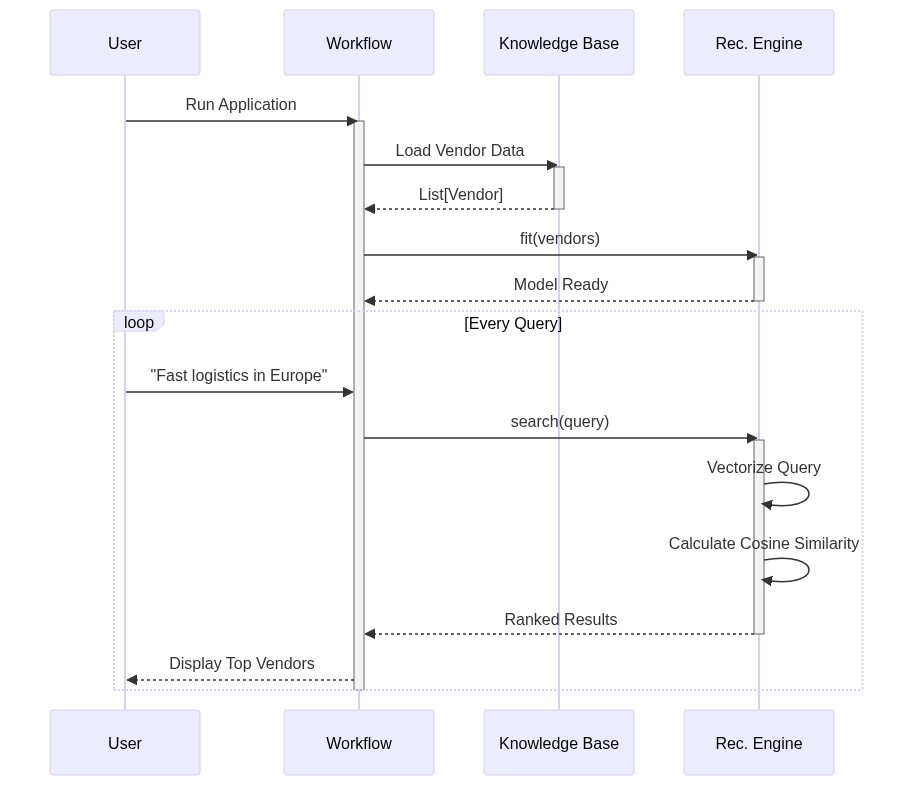
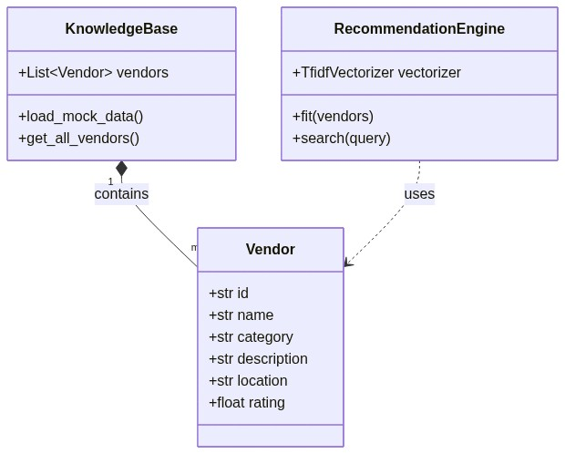

# SupplyChainAI: Intelligent Vendor Recommendation Engine


SupplyChainAI is a Proof of Concept (PoC) demonstrating how to build an intelligent vendor recommendation engine for enterprise procurement using basic Machine Learning techniques (TF-IDF and Cosine Similarity).

## 🚀 Overview

In the complex world of B2B procurement, finding the right vendor for niche requirements (e.g., "fast logistics for frozen goods in Europe") is a manual and error-prone process. This project automates the discovery phase by matching natural language queries against a knowledge base of vendor capabilities.



## 🛠️ Tech Stack

- **Python 3.12**
- **Scikit-Learn**: For TF-IDF Vectorization and Cosine Similarity.
- **Mermaid.js**: For all system diagrams.

## 📂 Project Structure

```
├── images/                 # Generated diagrams
├── src/
│   ├── knowledge_base.py   # Mock data and vendor schemas
│   ├── recommendation_engine.py  # Core ML logic
│   └── workflow.py         # Main execution script
├── generate_diagrams.py    # Helper to generate diagrams from code
├── requirements.txt
└── README.md
```

## ⚡ How to Run

1. **Clone the repository**
   ```bash
   git clone https://github.com/YOUR_USERNAME/SupplyChainAI.git
   cd SupplyChainAI
   ```

2. **Install Dependencies**
   ```bash
   pip install -r requirements.txt
   ```

3. **Run the Recommendation Engine**
   ```bash
   python src/workflow.py
   ```

   **Sample Output:**
   ```text
   Query: 'Need a fast logistics provider for frozen goods in Europe'
     > [0.1680] SpeedyTrans Logistics (Germany) - Logistics
   ```

## 📊 System Architecture

### Sequence Flow


### Class Structure


## 📝 Disclaimer

This project is an **experimental, personal** Proof of Concept and does not represent the views or software of my employer. It is intended for educational purposes only.

## 🔗 Connect

Check out the full article on [Dev.to](https://dev.to/YOUR_PROFILE).
